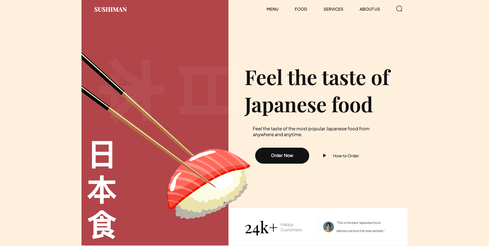

# Sushi Website 🍣
      
> A sleek and responsive website showcasing Japanese cuisine, created using HTML5 and CSS3 with engaging animations and a modular file structure.

 

---

## 📋 Table of Contents
1. [Introduction](#introduction)
2. [Tech Stack](#tech-stack)
3. [Features](#features)
4. [Quick Start](#quick-start)
5. [Code Snippets](#code-snippets)
6. [Useful Links](#useful-links)
7. [Tutorial](#tutorial)

---

## 🤖 Introduction
This project is a sushi-themed website featuring popular dishes, drinks, and trending sushi items. The website is created with responsive design and smooth animations using HTML5 and CSS3. Special thanks to [Adrian Hajdin](https://www.youtube.com/watch?v=QRrPE9aj3wI) for the YouTube tutorial that inspired this project.

## ⚙️ Tech Stack
- 
- 
- 
- 
- 
- 
-  

## 🍣 Features

- **[CSS Variables](https://www.w3schools.com/css/css3_variables.asp)**: Ensures efficient style management across the project.
- **[Importing CSS Files](https://developer.mozilla.org/en-US/docs/Web/CSS/@import)**: Promotes modular, organized, and reusable styling.
- **[Flex and Position Properties](https://css-tricks.com/snippets/css/a-guide-to-flexbox/)**: Creates flexible, responsive layouts with clean alignment.
- **[Rendering HTML through JavaScript](https://developer.mozilla.org/en-US/docs/Web/API/Document/createElement)**: Dynamically generates elements for streamlined updates.
- **[Smooth Animations](https://css-tricks.com/snippets/css/keyframe-animation-syntax/)**: Delivers subtle transitions to enhance user experience.
- **[BEM Method](https://en.bem.info/methodology/)**: Maintains structured, clear class naming for scalable code.
- **[Organized File and Folder Structure](https://www.smashingmagazine.com/2018/01/creating-organized-file-structure-web-projects/)**: Simplifies asset management and navigation.
- **[Responsive Design](https://web.dev/responsive-web-design-basics/)**: Adapts layout fluidly across all devices for optimal usability.

